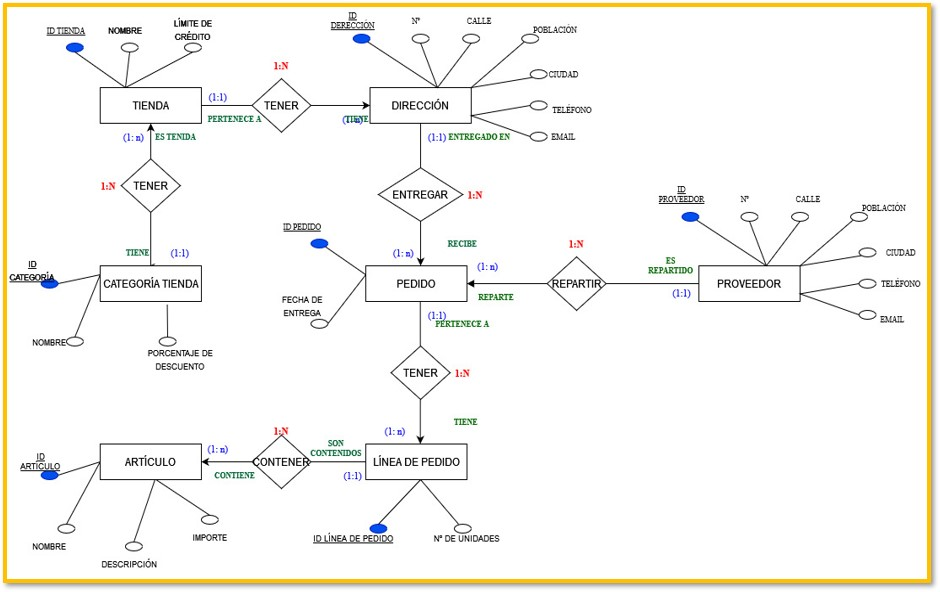
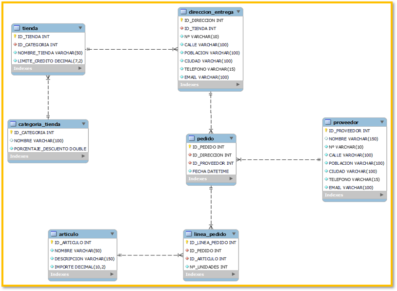

## **Bases de Datos Relacionales con MySQL**

Nos  contratan  para  realizar  el  diseño  funcional  de  base  de  datos  (diagrama  Entidad  –  Relación  y Relacional) de un modelo de negocio de un mayorista de moda que distribuye a 12.000 tiendas en todo el mundo, con las siguientes restricciones:

- Para cada tienda necesitamos almacenar la siguiente información: ID de tienda (único), direcciones de entrega (varias por tienda), límite de crédito de cada tienda (en ningún caso debe superar los 30.000 €) y nivel de descuento que estará en función de la categoría de tienda y en ningún caso superará el 20%.  
- Las tiendas se dividen en categorías, de acuerdo con el volumen de compras anuales, de forma que a mayor volumen de compra los descuentos serán mayores.  
- Las tiendas realizan pedidos al mayorista, es fundamental identificar en el pedido la tienda que lo realiza, la dirección de entrega, así como la fecha en la que se realiza dicho pedido. 
- Cada pedido dispone de líneas de pedido, en cada línea de pedido se determinará el identificador del artículo, descripción, su número de unidades y el importe de este.  
- Los artículos se distribuyen a cada tienda por varios proveedores, para identificar a cada proveedor se tendrá en cuenta, el ID de proveedor (único) y dirección de contacto.  

Nota: Una dirección se entenderá como Nº, Calle, Población, Ciudad, Teléfono y email. Una fecha incluye hora.  

Diagrama Entidad – Relación Modelo Relacional:

Modelo Relacional: 

Queries: 

1. Crear mediante instrucciones SQL las entidades de acuerdo con el modelo relacional definido y detallar para  cada entidad  los  atributos  que  forman  parte  de  la  PK  y  las  FK. 
1. Utilizar la instrucción SQL de inserción de datos para insertar una fila en la tabla de pedidos. 
1. Visualizar mediante una instrucción SQL todas las tiendas que componen la red de distribución de la fábrica, se deberán detallar: nombre de la tienda, dirección, descripción de la categoría, descuento y límite de crédito asociado a la tienda. 
1. Visualizar mediante una instrucción SQL los pedidos suministrados a cada una de las tiendas en un período determinado (último año). Se deberán obtener los siguientes datos: número de pedido, fecha de suministro, dirección de entrega, y el importe total del pedido. 
1. Identificar  mediante  una  consulta  SQL  los  repartos  realizados  por  cada  uno  de  los  proveedores destinados a ello. Se deberá identificar al menos: Nombre del proveedor de reparto, su dirección y la relación de los artículos suministrados en cada reparto. 
6. Totalizar los repartos anuales realizados por cada proveedor de reparto. 
6. Identificar los cambios a realizar en el modelo relacional y en BBDD para clasificar a los proveedores de reparto en categorías, de la misma forma que clasificamos las tiendas por categorías. 
6. Necesitamos introducir nuevos atributos en la tabla de artículos, la fábrica ha descubierto que puede comprar un artículo de parecidas características al nuestro y distribuirlo como marca blanca.  
6. Queremos ampliar la información del proveedor de suministro, para ello necesitaríamos incorporar los datos  relativos a  las zonas de  cobertura de este  (Países  y  Regiones).  Determinar  los  cambios a realizar a nivel físico y lógico. 
6. ¿Qué podríamos hacer para realizar un backup de la tabla de pedidos / líneas de pedido? Esto es, necesitamos hacer todos los días un proceso de backup a otra Base de Datos en las que se consolida toda la venta del grupo (pedidos, líneas de pedido). 

